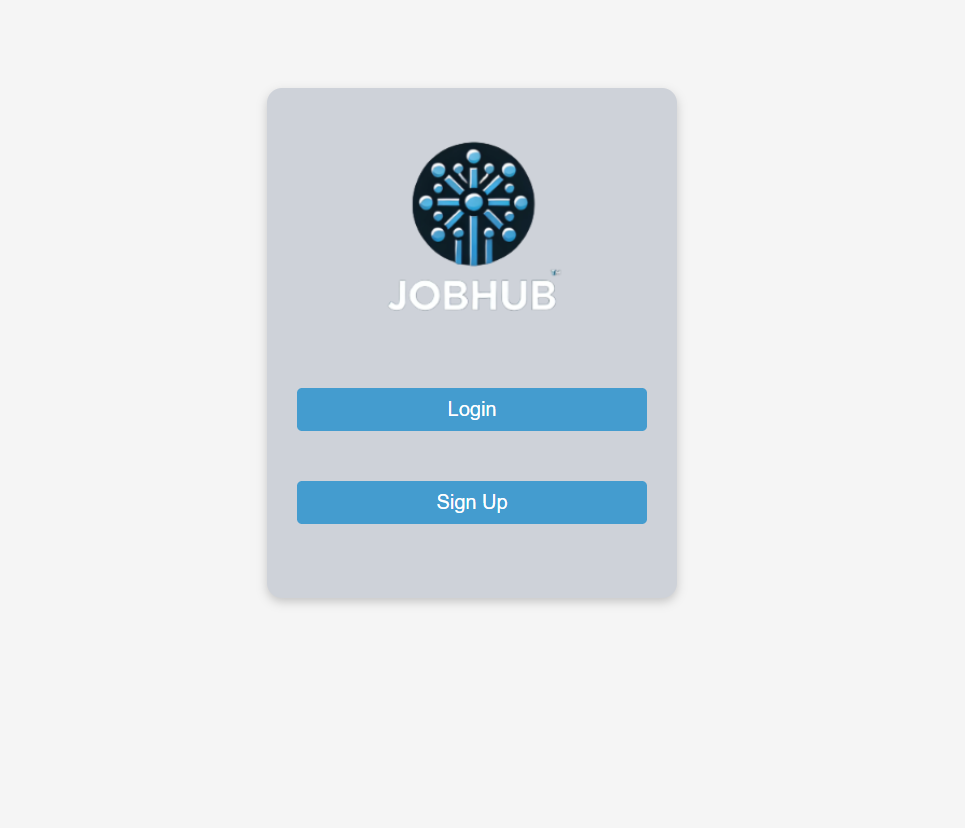
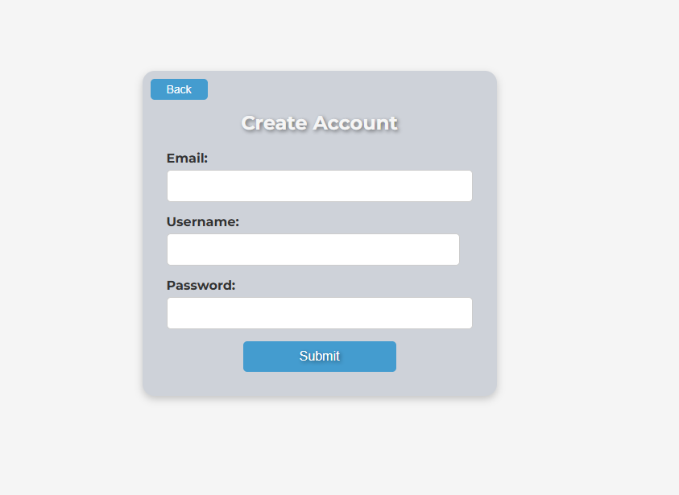
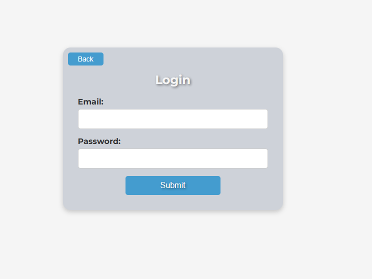
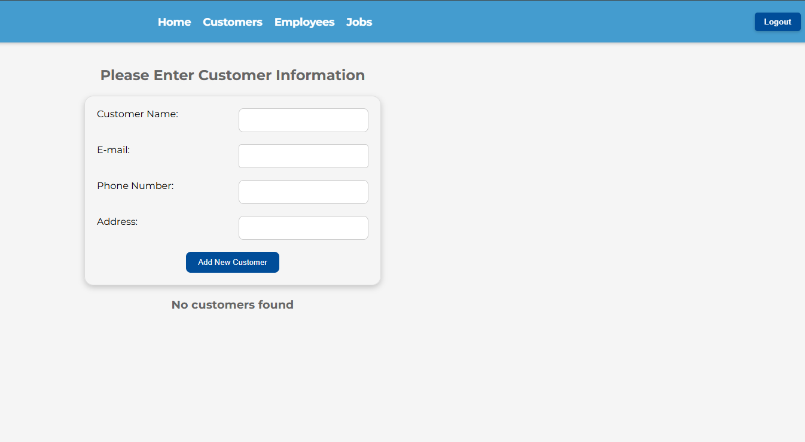
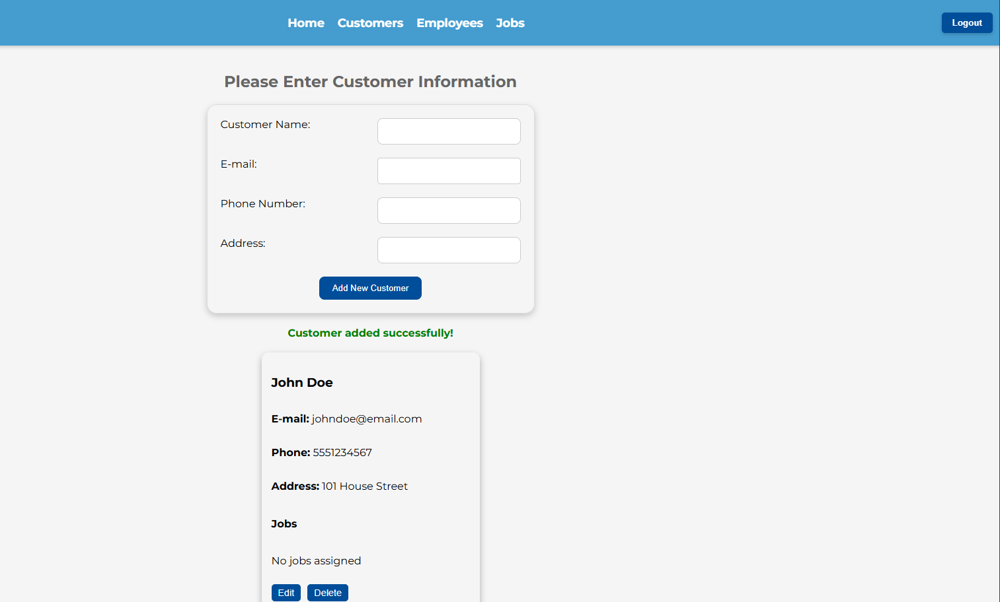
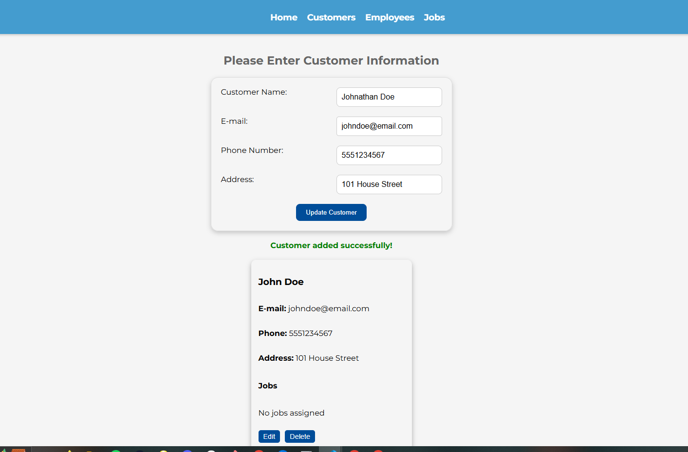
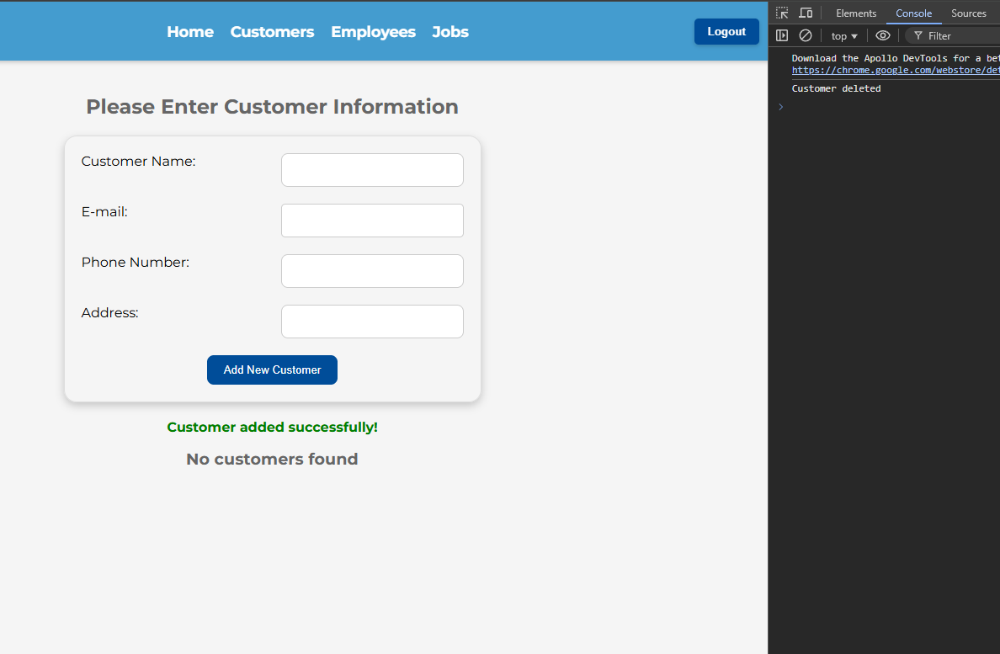
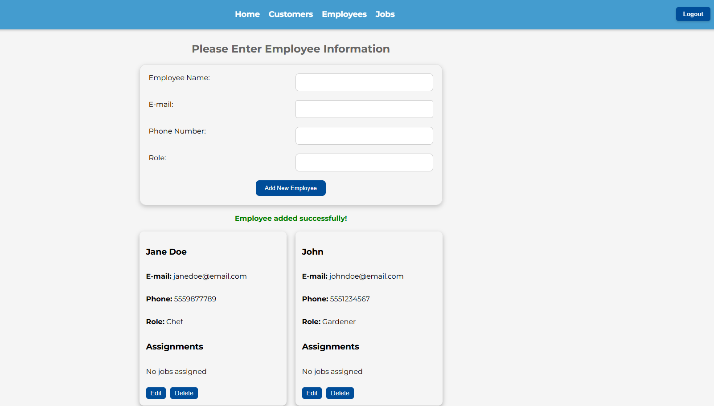
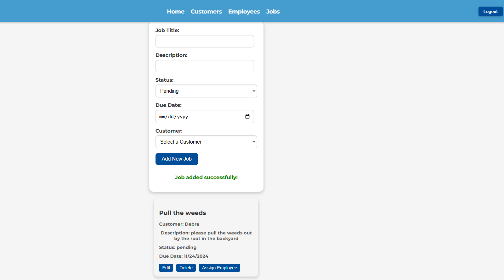
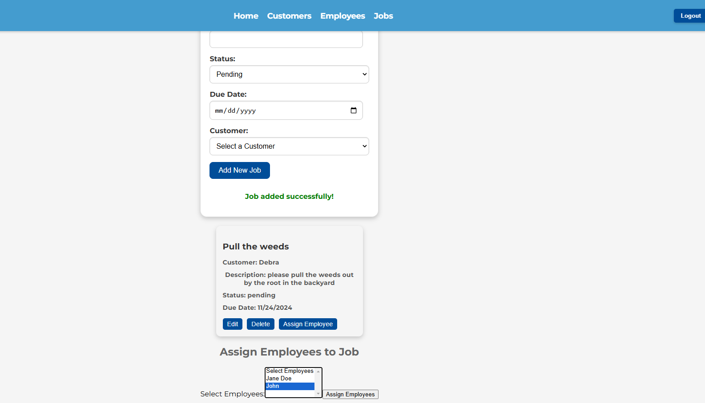

# JobHub

  

 JobHub is a comprehensive job and task management application designed to streamline the assignment of jobs, scheduling, and employee management for small to medium-sized businesses. The platform allows administrators to efficiently add, modify, and delete jobs, employees, and customers, ensuring that every task is assigned to the right person at the right time.
With secure login authentication, admins can manage jobs and assignments from a centralized dashboard while ensuring data privacy. Employees can view their assigned tasks, access job details, and stay updated on their schedules, allowing for better organization and productivity.
Whether you are managing a team of employees or handling multiple clients, JobHub provides an intuitive solution to optimize workload distribution, enhance communication, and keep track of job progress in real time.

Click here to view website: https://jobhub-fxiq.onrender.com

## Table of Contents

- [Installation](#installation)
- [Usage](#usage)
- [Screenshots](#screenshots)
- [Features](#features)
- [License](#license)
- [Credits](#credits)
- [Tests](#tests)
- [Credits](#credits)
- [Contact-Us](#contact-us)

## Installation

Before getting started you will want to make sure you install the following: 

* Node.js
* MongoDB

Once the repository files are on your local machine, you will want to navigate to the project directory. 
When you're in the project, navigate to the server by running 'cd server' in the terminal, and then install the dependencies by running 'npm install'. 
Now the same thing, but this time use 'cd client' and follow it with 'npm install' as well.
Locate the .env file and make sure you have the variable for 'JWT_Secret_Key'
Then you can navigate back to the server, and enter the command 'npm start'. This should start the server, and you should see a message stating that the
database has been connected, and that the server is running. 
Then you'll want to navigate back to the client and run npm run dev, and a link to http://localhost:3000/ should appear. 

## Usage

* User Authentication: 
    * Login or create an account via the landing page to access the platform's features. 

* Customer Management: 
    * Create, edit and delete customer profiles, including contact information and address. 

* Employee Management: 
    * Add, edit and delete employee records with roles and contact details. 

* Job Management: 
    * Create, edit, and delete job entries.
    * Assign jobs to employees.
    * Track and update the status of jobs as they progress. 

* Streamlined Workflow:
    * Easily manage relationships between customers, employees, and jobs. 
    * Keep all organizational data centralized and editable for efficient task handling. 

## Screenshots

Landing page, choose to login, or sign up!

Create an account

Login

 Add, view, edit, and delete customers on the customer page

 

 

Add, view, edit and delete employees on the employee page

Add a job

Assign an employee

## Features

* Sign in with username and password
* Create manager accounts with username, email, and password.
* Add, update and delete jobs and assign them to employees
* Track  job statuses. 
* Manage employee information and assignments.

## License

Licensed under MIT.
Further information on this can be found here: https://choosealicense.com/licenses/mit/

## Tests

## Credits

* Cameron Barfuss
* Mekenna Baker
* Pedro Chipana
* Zach Hill

* Edx Bootcamp Instructors and TAs for guidance.
* Documentation sites such as: W3 schools, MDN docs, React docs, and Apollo docs. 

## Contact Us

| Name                | Email                      | GitHub                                    | LinkedIn                                                           |
|---------------------|----------------------------|-------------------------------------------|--------------------------------------------------------------------|
| Cameron Barfuss     | runnerrupert22@gmail.com   | [GitHub](https://github.com/Runnerrupert) | [LinkedIn](https://www.linkedin.com/in/cameron-barfuss-aa6217235/) |
| Mekenna Baker       | mekenna.drabner@gmail.com  | [GitHub](https://github.com/Mekenna-Baker)| [LinkedIn](https://www.linkedin.com/in/mekenna--baker/)            |
| Pedro Chipana       | pedro.chipana94@gmail.com  | [GitHub](https://github.com/PeruvPowWow)  | [LinkedIn](https://www.linkedin.com/in/pedro-chipana-984b5a119/)   |
| Zach Hill           | zhill0950@gmail.com        | [GitHub](https://github.com/zhill0950)    |                                                                    |